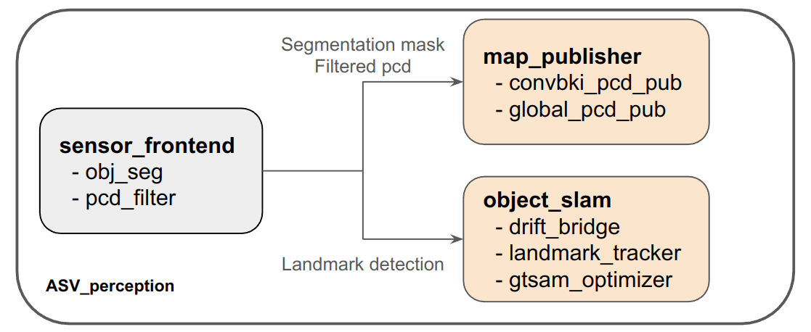

# Welcome!

Thank you for your interest in Convolutional Bayesian Kernel Inference (ConvBKI).
ConvBKI is an optimized semantic mapping algorithm which combines the best of 
probabilistic mapping and learning-based mapping. ConvBKI was previously presented
at ICRA 2023, which you can read more about [here](https://arxiv.org/abs/2209.10663) or 
explore the code from [here](https://github.com/UMich-CURLY/NeuralBKI). 

In this repository and subsequent paper, we further accelerate ConvBKI and test
on more challenging test cases with perceptually difficult scenarios including
marine surface environment. An example from the VRX simulation is playing below.

<p align="center">
  
</p>

ConvBKI runs as an end-to-end network which you can test using this repository! To test ConvBKI,
clone the repository and have your pre-processed ROS2 bags ready (or your vrx simulation if feeding the odometry/pose online).

Next, simply navigate to the EndToEnd directory and run 'semantic_pcd_publisher.py'. Once the 
network is up and running as a ROS2 node, begin playing the ROS2 bag (or the simulation for online feed). Note that you will need
to open RVIZ2 if you want to visualize the results.
We use Grounded-SAM2 for semantic segmentation, which you can find installation instructions on [here](https://github.com/IDEA-Research/Grounded-SAM-2).

But we RECOMMEND following the below instructions to install Grounded-SAM2 else there maybe dependency conflicts. We also provide a configuration file to create a conda environment, tested on Ubuntu 22.

For more information, please see the below sections on how we preprocessed poses,
and more information on parameters. 

### Note
This branch provides a ROS2 (Humble) wrapper for an end to end ConvBKI based 3D semantic mapping pipeline, combining perception, mapping, and object-level SLAM. It integrates with the [DRIFT](https://github.com/UMich-CURLY/ASV_localization) localization module for pose estimation and uses object landmarks for map refinement. The pipeline is as below.

<p align="center">
  
</p>

1. Sensor Frontend: Preprocesses raw sensor data, including LiDAR projection and filtering, as well as camera-based semantic segmentation (YOLO or Grounded-SAM2).
2. Semantic Map Publisher: Fuses filtered LiDAR point clouds with camera segmentation outputs to generate a 3D semantic map.
3. [Object SLAM](https://github.com/UMich-CURLY/ASV-Object-SLAM): Uses detected object landmarks to reduce drift and improve global consistency in localization. Integrated from the linked repository.


## Install
- Tested on Ubuntu 22.04 (with cuda 11.8.0)
```bash
git clone --recurse-submodules -b ros2_w26 git@github.com:UMich-CURLY/ASV_perception.git
cd ~/ASV_perception
conda env create -f envs/asv_perception.yaml
conda activate asv_perception
export CUDA_HOME=/usr/local/cuda-11.8/
sudo apt-get install libsparsehash-dev
```

<!-- For Grounded-SAM2 -->
<!-- ```bash
cd ~/ASV_perception/src/semantic_mapping/ConvBKI/Segmentation/
pip install -e .
pip install --no-build-isolation -e grounding_dino
cd checkpoints
bash download_ckpts.sh
cd ..
cd gdino_checkpoints
bash download_ckpts.sh
``` -->

```bash
cd ~/ASV_perception/src/semantic_mapping/ConvBKI/torchsparse/
git checkout v1.4.0
python setup.py install
export LD_PRELOAD=/usr/lib/x86_64-linux-gnu/libtiff.so.5
```

### Build ROS workspace
```bash
cd ~/ASV_perception
source /opt/ros/humble/setup.bash
colcon build --symlink-install
source install/setup.bash
```

## Run Perception Pipeline
The pipeline has 3 main components. Open **separate terminals** and start each module:

### 1. Sensor Frontend (Camera + LiDAR Processing)

Executed scripts: 
1. Image segmentation using YOLO: ```objseg_yolo.py```
2. Point clouds projection and filtering: ```pcdFilter_node.py```

```bash
conda activate asv_perception
cd ~/ASV_perception
source install/setup.bash
ros2 launch asv_perception sensor_process.launch.py
```

---

### 2. Semantic Map Publisher

Executed scripts: 
1. Per-frame semantic point clouds publisher: ```semantic_pcd_publisher.py```
2. Global semantic point cloud publisher: ```semantic_pcd_publisher_global.py```
3. Occupancy grid map publisher: ```ogm_builder.py```

```bash
conda activate asv_perception
cd ~/ASV_perception
source install/setup.bash
ros2 launch asv_perception map_publisher.launch.py
```

**Note:** Visualizing large maps in RViz2 can be computationally expensive.

#### (Optional): Object Localization Visualization

Launches augmented-reality-style object position visualization:

```bash
conda activate asv_perception
cd ~/ASV_perception
source install/setup.bash
python cluster_global_pub_objects.py
```

---

### 3. Object SLAM

Executed scripts: 
1. Anchor and keyframes generation: ```drift_bridge.py```
2. Landmarks tracking and association: ```landmark_tracker.py```
3. Graph optimization : ```gtsam_optimizer.py```

```bash
conda activate asv_perception
cd ~/ASV_perception
source install/setup.bash
ros2 launch asv_perception obj_slam.launch.py
```

---

## Provide Sensor Data

Provide sensor data using one of the following:

### Option A: Play a Processed ROS 2 Bag

```bash
ros2 bag play your-bag.db3
```

### Option B: Run VRX Simulation (Blueboat)

```bash
ros2 launch vrx_gz competition.launch.py world:=sydney_regatta urdf:=src/vrx_urdf/draft_blueboat/urdf/blueboat_sim.urdf
```

#### YAML Parameters

Parameters can be configured in:

```bash
ASV_perception/src/configs/params.yaml
```

### Sensor Topics

* `lidar_topic`  
  LiDAR point cloud topic to subscribe to.

* `camera_topic`  
  Camera image topic to subscribe to.

* `caminfo_topic`  
  Camera intrinsic calibration (`CameraInfo`) topic.

### Localization Topics

* `pose_topic`  
  Pose topic used for localization (e.g. DRIFT).

---

### Frame Definitions
* `global_frame`  
  Global (world) frame name.

* `base_link_frame`  
  Vehicle body frame name. 

* `camera_optical_frame`  
  Camera optical frame name.

* `lidar_frame`  
  LiDAR frame name.

---

* num_classes - number of semantic classes
* rviz_colors - color mapping for each class used in RViz visualization
* ConvBKI parameteres:
  - grid_size, min_bound, max_bound, voxel_sizes - ConvBKI map paramenters
  - f - ConvBKI layer kernel size...if you actually want to change this, pls do so in src/semantic_mapping/ConvBKI/ConvBKI/ConvBKI.py...its the variable 'max_dist' there at line 12
  - not using: res, cr (parameters for SPVNAS segmentation net)


## Acknowledgement
We utilize data and code from: 
- [1] [SemanticKITTI](http://www.semantic-kitti.org/)
- [2] [RELLIS-3D](https://arxiv.org/abs/2011.12954)
- [3] [SPVNAS](https://github.com/mit-han-lab/spvnas)
- [4] [LIO-SAM](https://github.com/YJZLuckyBoy/liorf)
- [5] [Semantic MapNet](https://github.com/vincentcartillier/Semantic-MapNet)

## Reference
If you find our work useful in your research work, consider citing [our paper](https://arxiv.org/abs/2209.10663)
```
@ARTICLE{wilson2022convolutional,
  title={Convolutional Bayesian Kernel Inference for 3D Semantic Mapping},
  author={Wilson, Joey and Fu, Yuewei and Zhang, Arthur and Song, Jingyu and Capodieci, Andrew and Jayakumar, Paramsothy and Barton, Kira and Ghaffari, Maani},
  journal={arXiv preprint arXiv:2209.10663},
  year={2022}
}
```
Bayesian Spatial Kernel Smoothing for Scalable Dense Semantic Mapping ([PDF](https://ieeexplore.ieee.org/stamp/stamp.jsp?tp=&arnumber=8954837))
```
@ARTICLE{gan2019bayesian,
author={L. {Gan} and R. {Zhang} and J. W. {Grizzle} and R. M. {Eustice} and M. {Ghaffari}},
journal={IEEE Robotics and Automation Letters},
title={Bayesian Spatial Kernel Smoothing for Scalable Dense Semantic Mapping},
year={2020},
volume={5},
number={2},
pages={790-797},
keywords={Mapping;semantic scene understanding;range sensing;RGB-D perception},
doi={10.1109/LRA.2020.2965390},
ISSN={2377-3774},
month={April},}

```
